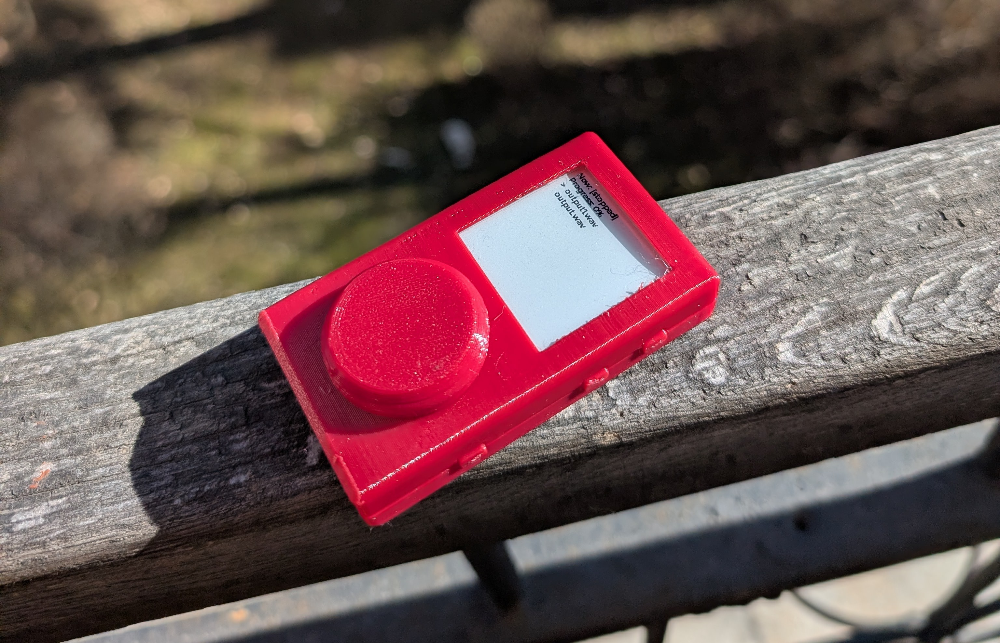

# 2026.07.12: Thinking of what I need to change

*This will be a long journal, because I did a lot of research beforehand*

For v2 I went with a MCU(microcontroller unit) which are low power processors, and can't run normal OSs. This - I found out while developing the firmware - was a really limiting factor, mainly because the embedded rots that I was forced to use with this specific MCU(nrf5380), Zephyr. 

## Zephyr rant

The thing to know about Zephyr that is has literally no docs for any of the built-in drivers, so you have to look at examples(if they even exist) to figure out how the hell the driver works. In theory Zephyr would be awesome, it is similarly structured to how linux works, has a bunch of built-in drivers, has standard APIs for similar peripherals, and a bunch of cool stuff, but in reality the lack of docs, the complicated build system, the unclear runtime errors just make it impossible to actually use.

Thank you for listening to my rant.

## The solution: Linux

I realized with the features I wanted (wifi, bluetooth, ble, high quality audio, streaming support, usb dac functionality) linux was a must, it has better docs, support for a bunch of ICs that I need, etc. But to run Linux I need an MPU(microprocessor unit), the main difference between an MPU and MCU is that the MPU has an MMU(memory management unit), which allows the use of external memory - like DDR - which Linux needs to run (doesn't actually, but in reality it's a necessity.

## Choosing an MPU

This is the part that I'm still not done with, I'm really torn between the SAMA7 series from Microchip and the STM32MP1 series from STM, both are really awesome chips, the sama7 has a really good audio engine and relatively good gpu, and the stm32 is really easy to implement and it also has a pretty good gpu and audio peripheral. I would lean towards the sama7, but that is only available in a 0.65mm BGA package, which is really hard to fan out, while the stm32mp1 has a 0.8mm pitch, which is really easy to use. I think the strategy i will go with is to try to route the sama7, and if i fail miserably, I will switch to the stm32.

Two articles were really helpful researching this topic: [this one](https://jaycarlson.net/embedded-linux/), and [this one](https://www.thirtythreeforty.net/posts/mastering-embedded-linux-part-1-concepts/)

## 70hz e-paper

V2 had a normal e-ink screen, which had a max partial refresh rate of 0.5s, which is really bad, but for a music player it's alright. But I wanted more!!! So I found out about Sharp MIP displays, which give the effect of e-ink - they don't have a back light, are mostly black and white and they are really low power - but they have a higher refresh rate and always need to by powered, for example the display that I choose(LS022B7DH03) has 70Hz.

## RAM

One of the main reasons I didn't go with a SiP(an IC where both the MPU and RAM are in the same package), because they mostly only package DDR3L or DDR2L, which have significantly higher power consumptions than LPDDR2/3. Both of my chosen MPUs support both LPDDR2 and LPDDR3, so I will be most likely going to use LPDDR3, and 512MB of it, because these MPUs would be sooner bottle necked by their performance than from the amount of RAM, and 512MB seems to be the sweet spot from what I read on forms/articles.

## *Time Spent: 8h*

# 2026.07.15: Making a custom BGA symbol = HELL

So I realized that the sama7 doesn't have a premade footprint and symbol :YAYAYAY: 

## Footprint

I heard from Cyao that kicad has some pretty good built in BGA footprint generators, so I started researching. Turns out it's pretty easy to use, you only need to add a new entry to a YAML file with the specs of your footprint, and boom, you have a 3d model and footprint. I even made a [pool request](https://gitlab.com/kicad/libraries/kicad-footprint-generator/-/merge_requests/2132) to the main repo, so the footprint can be included in the kicad default library.

## Symbol

This is the part that is hell.

First the [official kicad symbol generator](https://gitlab.com/kicad/libraries/kicad-library-utils/-/tree/master/symbol-generators?ref_type=heads) doesn't work out of the box, I had to ask gemini to fix it 💀 Also the documentation is really hard to find for both the footprint generator and symbol generator. Also microchip doesn't provide a clean .csv file that I can easily process, that would be to easy, instead they have all their pins listed in a html table, with a bunch of rowgroups and stuff, that makes it really hard to parse. I spent like 1.5h getting this fricking script working, but in the end with the help of gemini I had made a script that converts the html table into a csv file that the kicad symbol generator can use. So now I have a massive monolithic symbol, with all the pins, and their alternate functions, that I now need to split up into separate units.

## Also, I did some ram research

I asked around in a bunch of communities for advice on ddr3 learning resources, and I got some really god answers. Turns out bit/byte swapping on lpddr3 is a bit more complicated, but I still don't fully understand and need to do more research. I hope I don't even need to do this, crossing my fingers!!!

## *Time Spent: 6h*

# 2026.07.16: Split apart the symbol

This was mostly a long monotonous but fun process of looking at the datasheet and organizing the pins into units.  I took a bunch of inspiration from Cyao's sbc.

## *Time Spent: 4h*

# 2026.07.19: Made PMIC symbol and did some research

## PMIC

Microchip recommends two PMICs for the sama7, the mcp16501 and mcp16502, the mcp16501 can't do dynamic voltage adjustment, and doesn't let the sama7 go up to 1GHz, so the obvious choice was the mcp16502. Luckily component search engine already had a base symbol that I could use as a starting point, but it had the pins arranged based on the footprint,so I just needed to arrange the pins in a way that it made sense. I used a built in footprint from kicad, so I didn't have to make that.

## RAM research

I messaged Cyao about where he sourced his ram when he made his sbc, because I couldn't find lpddr3 on mouser/lcsc/digikey, and other western sites sold these chips for pretty expensive. Turns out taobao has some pretty cheap ram, $5 for 1GB. 

Also I learned that GB and Gb are different, GB is a gigabyte and Gb is a gigabit, which is 8 times smaller than a gigabyte. Thanks cyao!

In the end I landed on a 16Gb chip from samsung called K4E6E304EC, it's a 174 ball bga. and is around $7.5. I don't need 2 GB, but you only live once, and it's not that expansive compared to the whole board.

I submitted a footprint creation request to component search engine, it should take 1-2 days for them to make it, I will make a custom symbol.

## Thank again you Cyao for all the help!!!!!

## *Time Spent:4h*

# 2026.07.20: Making RAM symbol and RAM troubles

## Symbol

I realized that I really like making symbols, it's just a really relaxing process, and I can learn a lot about the IC I'm making the symbol for.

Turns out, the pin table in KiCad doesn't have a "visible" field, so I had to use a text editor to mass hide pins, like gnd and vcc, so for example I can have one gnd pin instead of sixty-seven-thousand.

But I realized something...

## RAM troubles

The DRAM IC I chose has a 32 bit wide data bus, but my MPU only has a 16 bit wide DRAM controller, hmmmmmmmmmmmmmmmmm

So I dived into the datasheet, now this is where it got really confusing, because the datasheet mentioned x16 multiple times, so I went the EE discord to ask what the helly is going on, does this IC support both x16 and x32??

The first answer I got told me that I can't use this IC, but then another guy joined the conversation and said that I could use this IC, and they also provided some evidence hmmmmmmmmmmmmmmmmmmm

So I went on a search for an LPDDR3 chip that had a 16 bit wide data bus. But I couldn't find any, there were all 32 bit wide 😮 So my DRAM IC must have support for a 16 bit wide data bus, but I'm still not 100% sure, and still have to do more research

Also made a stack exchange post, but that didn't get any replies :sob:

## *Time Spent: 4h*

# 2026.07.26: Microchip support saves me

## RAM

So after I did a bunch more research, I asked microchip's live chat if they had any example of the sama7 being used with lpddr3, and turns there are examples with with X32 memory WOOOOOOOOOOOOOOOOOOO

But I still had a bunch of questions about this example, like do I lose half the capacity, or do I only lose speed, but the live chat support person said that I should create a regular support ticket for these questions, cuz they didn't know. So I did that, and waited eagerly.

A few days later I got a wall of text as a response, which explained everything I LOVE U BARATH V. FROM MICROCHIP

Turns out almost all x32 LPDDR3 devices(I learned that they call DDR ICs devices from Barath) have an x16 mode, but the datasheets don't make this clear at all, but I also got feedback on the specific DDR device I chose (<3 microchip) and it has this feature, in x16 you get half the speed but the full capacity of the device. 

But turns out that there was another factor that would have halved my capacity, which was that the device I chose was actually two ddr chips put in one package, and required two CS and CKE pins, but the sama7 only has one CS and CKE pin for ddr devices, so I could have only used one of the chips in the package. The solution? Use a device that doesn't have two chips inside one package, which means use one with half the capacity, so in the end I will have an 8Gb/1GB ddr device.

Luckily the footprint doesn't change at all, I only have to mark two pins as NC (CS1 and CKE1), and rename CS0 to CS and CKE0 to CKE.

With my new found knowledge I connected the ram to the sama:

## Display

I looked around a bit for displays to see if there were any better options than my current choice, mainly I wanted a larger display, so I could have more room for the PCB, but all the larger MIP panels had a horrible refresh rate, like 15Hz, which was unacceptable compared to the current 70Hz one. So I didn't change anything else

## PWR

Started looking for a powerpath, charger and fuel gauge IC, I may have found one from analog devices, but i'm still not sure about it.

## *Time Spent: 6h*

# 2026.08.06: Wireless shenanigans and making power IC symbols

## Finding a good wireless IC and datasheet shenanigans

At first I wanted to use the NXP IW611 as a bare IC, but the PCB layout looked painful, and if I want to sell Meko V3 later I have to go through an expansive certification process. So I went looking for modules, and along that way I found the U-Blox Maya-W3, which uses the Infineon CYW55513, which has Bluetooth 6 :yayayayay:

I asked Component Search Engine to make a footprint and symbol for the Maya-W3, but the first time they rejected it for the reason of "The datasheet doesn't have enough info", but it did. So I submitted again, and now they made it in under 24h, yipeee

But as always, the footprints are nice from CSE, but the symbols are crap. So I had to remake that, and I glad I did, because I discovered that the Maya-W3 datasheet is also terrible. It lists the max I2S sample rate as 8kHz, which is really bad, like old call quality, and I realized this just at the end of me finishing the symbol, shi. I also looked at the NXP IW611 I2S sample rate, and it also capped out at 8kHz... Then as my last hope I checked the datasheet of the Infineon CYW55513 (the chip that the maya uses), and it listed its max I2S sample rate at 96kHz, this is excellent!!! So in the end I will use the Maya-W3.

Side note: Both the maya-w3 and cyw55513 datasheet mention SMIF pins, but don't mention at all what they are used for. If you google SMIF it comes up with an Infineion page that says that it's just spi, and if you check out cyw55513 example designs the SMIF pins are connected to an external flash and psram, so idk if I should connect them, so I reached out to support, but they haven't responded.

## Finding power ICs

Turns out there aren't any good ICs that all have powerpath, a fuel-gauge and a battery charger, so I separated the fuel gauge into a separate IC. For the battery charger I choose the BQ25640, it has USB-OTG, USB-PD, voltage monitoring support and a bunch of other cool features. And for the fuel gauge i choose the MAX17260, which is a really simple and good fuel gauge IC, nothing special, i uses a TDFN-14 package. On the other hand the BQ has a rally funky TI package, so I asked snapmagic to make that for me :skull:

I made the symbols for them cuz the pre made ones were ass:

There are also some shenanigans with the TI BQ IC, cuz it has D- and D+ pins, and the datasheet doesn't mention what to do when you don't want to use them, so I made a support ticket.

## *Time Spent: 7h*

# 2026.08.16: Finished Power

## Mucking around with ESD

For the USB port I just choose a standard 16 pin USB 2.0 connector, nothing fancy. But now I needed some ESD protection.

I checked out the SAMA7D6 example design, and they used an IC that had both ESD and filtering, I have never seen this before, and it seemed pretty cool, so i wanted to use a similar IC. After searching for one of these ICs that was available on LCSC the one I choose luckily already had a built in KiCAD symbol.

Now came the VBUS and CC pin ESD protection part. While researching I found out that the CC lines can short to VBUS when plugging/unplugging a USB cable. At this time I still thought that my BMS supported USB-PD, and that VBUS can go up to 21V. So I thought that I needed an IC that protected against this, so the CC lines don't get 21V on them. So i did a bunch of research, found a part, made a symbol, downloaded a footprint, etc. Just to realize that first of my BMS could tolerate up to 26V on the CC lines, and secund that my BMS didn't support PD, so VBUS would only go up to 5V. So I ditched this complicated IC and just used simple TVS diodes.

## Implementing the power ICs

This was mostly just reading the datasheets a bunch.

### BMS

I asked in the the TI dev forums regarding the D-/+ pins, and what to do with them if i don't want to use them. They replied and said that I should just leave them unconnected. The rest was pretty easy.

Also the BMS doesn't shut down the battery output until it reaches 2.4V, and by that point, that battery would probably be completely dead and unusable. So I will need to implement a software shutdown when the battery voltage reaches like 3.2V. Luckily the fuel-gauge has a battery voltage readout register, so I can use that. My MPU works down to 3V, so 3.2V should be fine.

### Fuel-Gauge

I learned a lot about fuel-gauges. One of the things i learned is how a Coulomb counter works, and how to choose the sense resistor.

### PMIC

Setting up the switching regulators was pretty easy, just had to read the recommended part values.

The more interesting part is the low-power/high-power/hibernate modes. The SAMA7D6 needs a backup sources called VBAT to keep the ram in self refresh mode. First I thought that I needed another LDO for this input which is always on, so I again found a part, made a symbol, etc. But then again realized, that my PMIC had an unused LDO, which I could configure via I2C to always be on, except when the PMIC fully shuts down. This way, the device can hibernate while keeping the ram in self-refresh mode.

