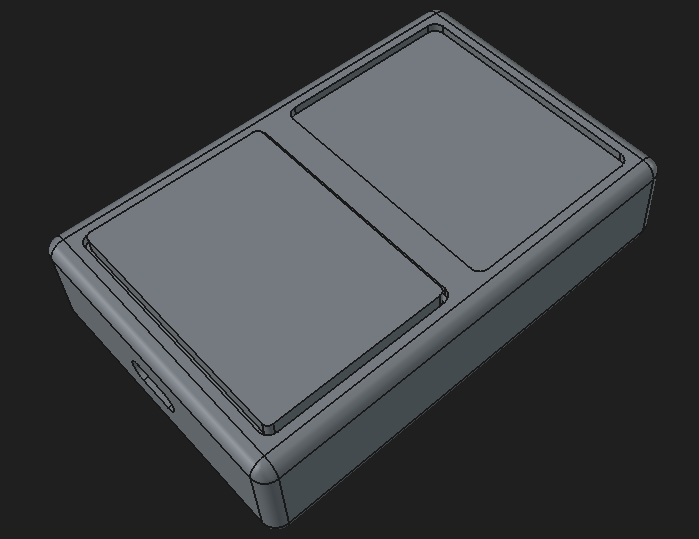

> [!CAUTION]
> V3 is a WIP, if you want updates follow my [journal](JOURNAL.md). Check out the [v2 branch](https://github.com/KOEGlike/meko/tree/v2) for a completed project

# Meko

A linux music player with ddr3, a 70hz e-paper display and a haptic touchpad

## Components

- **_MPU_**: SAMA7D65, it can boost up to 1GHz, good audio subsystem and gpu
- **_RAM_**: Half a gig of DDR3L(MT41K256M16TW)
- **_EPD_**: Sharp MIP LS022B7DH03, can go up to 70Hz, 240x320
- **_Audio_**: TAC5212 
  - **_DAC+AMP_**: 192kHz, 32-bit, 120dB SNR, 2Vrms
  - **_ADC_**: 192kHz, 32-bit, 119dB SNR
- **_Wireless_**: Bluetooth 6 with LE audio and WiFi 6E
- **_Touchpad_**: IQS7211E touch IC with DRV2605 haptic LRA driver
- **_USB_**: USB 2.0 with OTG

## Journals

Each versions has a detailed journal:

[V3 journal](JOURNAL.md)

[V2 journal](JOURNAL_OLD_V2.md)

[V1 journal](JOURNAL_OLD_V1.md)
